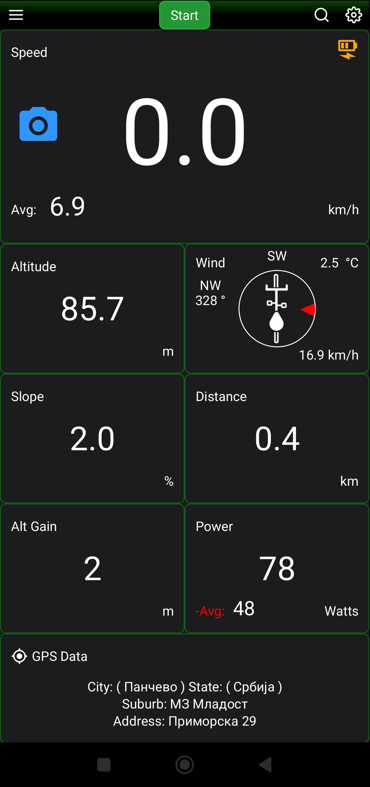
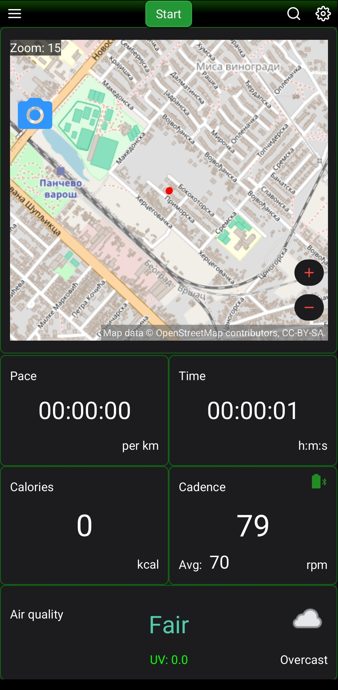
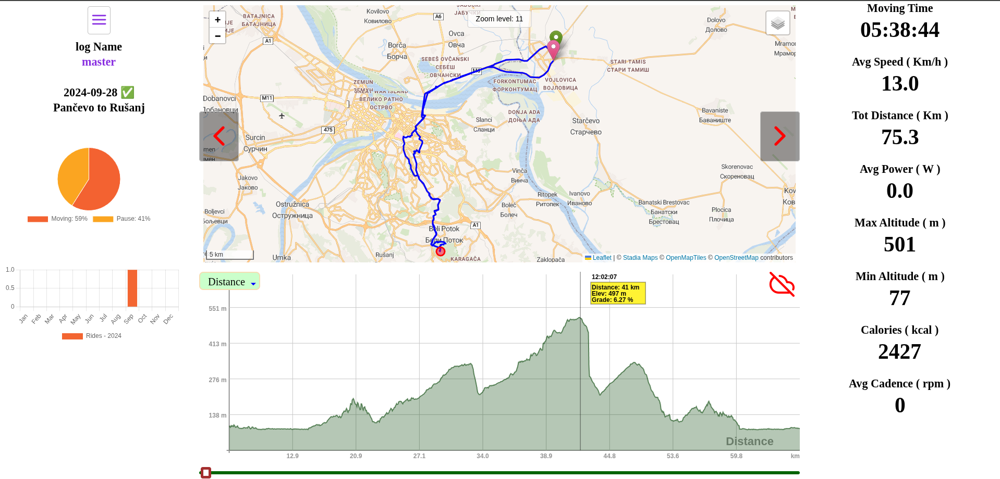

# Cycle Power

**Cycle Power** is a high-performance, open-source cycling computer designed specifically for mobile devices (Android & iOS). Built with JavaFX and compiled natively, it provides real-time data tracking for cyclists who want precision and a modern interface.


> [!IMPORTANT]
> **Status:** Project is in active development.
> Bluetooth sensor integration (Power/Cadence) is currently being implemented.
> 
[](https://github.com/gluonhq/gluonfx)
[](https://openjdk.org/)
[](https://openjfx.io)
[](https://github.com/mkpaz/atlantafx)
[](https://github.com/CommonGrounds/CyclingPower_Mobile)
[](https://github.com/CommonGrounds/CyclingPower_Mobile/stargazers)
[](https://github.com/CommonGrounds/CyclingPower_Mobile/commits/main)


**[Try the Web Dashboard ➔](https://cyclingpower-web.onrender.com)**.

## 🚴🏼 Features

* **Real-time Metrics:** Track speed (current/average), altitude, slope, and distance.
* **Advanced Environmental Data:** Stay safe with integrated **Air Quality** monitoring, **UV Index**, and weather conditions (Fog, Temperature).
* **Wind Awareness:** Unique wind direction and speed indicator to help you manage your effort against headwinds.
* **Power & Cadence:** Support for external sensors to track power output (Watts) and pedaling cadence (RPM).
* **Live Mapping:** Integrated OpenStreetMap view to track your route in real-time.
* **GPS Precision:** Detailed location data including city, suburb, and street-level addressing.

---

## 📸 Screenshots
<p align="center">
  
  
</p>

<p align="center">
   
</p>

### 🌐 Web Dashboard
[Live Demo](https://cyclingpower-web.onrender.com)  
*(Note: Hosted on a free tier. If the page doesn't load immediately, please wait ~30 seconds for the server to spin up.)*


## 🛠 Tech Stack

* **[Java 17+]():** The core programming language.
* **[JavaFX 21+]():** For the cross-platform UI layer.
* **[GluonFX]():** Used to compile the Java bytecode into native ARM code for Android and iOS, ensuring high performance.
* **[AtlantaFX]():** A modern CSS theme library that gives the app its sleek, "native-feel" dark mode interface.


## 🧩 Architecture Highlights

- **View Layer:** Modular UI components built using `GridPane` and `AtlantaFX` cards.
- **Map Integration:** Leveraging `com.gluonhq.maps` with custom layers for POI (Points of Interest) and GPS tracking.
- **Sensor Data:** Decoupled data logic using JavaFX `StringProperty` and `IntegerProperty` for seamless UI updates.


### 📶 Bluetooth Smart (BLE) Integration
- **Custom Cadence Logic:** Developed a robust interpreter for CSC (Cycling Speed and Cadence) profile data.
- **Signal Processing:** Implemented Low-Pass and Exponential Smoothing filters to handle irregular BLE notification intervals and ensure steady RPM display.
- **Battery Management:** Integrated periodic battery level checks for connected sensors.
- **Smart Power Estimation:** No power meter? No problem. The app estimates your mechanical power output (Watts) using real-time speed, grade (slope), and wind resistance data.

---

## 🏗 Getting Started

### Prerequisites

* GraalVM with `native-image` installed.
* Configured environment for Android/iOS development (Android SDK/Xcode).

### Build & Run

Ensure you have **GraalVM** and **Maven** configured.

Clone the repo:
```
git clone https://github.com/CommonGrounds/CyclingPower_Mobile.git
```

To run the application in development mode:

```bash
mvn gluonfx:run
```

To build a native mobile package:

```bash
mvn clean -Pandroid gluonfx:build gluonfx:package
```

---

## 📄 License


> This project is licensed under the Apache 2.0 License.See `LICENSE` for more information. Note that it depends on GluonFX, which is licensed under GPLv3 for open-source projects.
